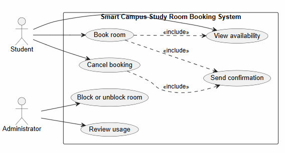

# Lab report — Practice #03, Requirements Engineering with AI

Fill in every section. **Do not delete or renumber the headings** — the README points at them and a
missing heading reads as a missing section.

Name: Olzhabay Kuanysh
Student ID: 24B031954
GitHub username: kuanysh14

---

## 1. Setup

| |                 |
| --- |-----------------|
| AI assistant (tool) | Claude          |
| Exact model name and version | Claude Sonnet 5 |
| Date of the session | 27.09.2026      |
| Diagram renderer used |                 |

One tool and one model for all three prompts. If you switched, say why here — it changes what your
findings mean.

---

## 2. Original AI output — user stories (Part 1)

Paste the **unedited** response to Prompt 1. Do not tidy it. If it is long, paste all of it anyway;
this is the baseline everything else is measured against.

```
**Student**

1. As a Student, I want to view which rooms are free and when, so that I can choose a time slot without contacting library staff.
 - Priority: High
 - Assumption: Availability shown reflects all current bookings and blocks in real time.

2. As a Student, I want to book a free room for a specific time slot, so that I have a guaranteed quiet space for study.
 - Priority: High
 - Assumption: The system rejects any slot that starts in the past, exceeds two hours, or overlaps an existing booking.

3. As a Student, I want to cancel a booking I made, so that I can release the room when my plans change.
 - Priority: Medium
 - Assumption: A student can cancel only their own bookings, and only before the booking's start time.

4. As a Student, I want to receive a confirmation when I book or cancel a room, so that I have clear proof of my reservation status.
 - Priority: Medium
 - Assumption: Confirmation is shown/delivered within the web application itself, not via SMS or push notification.

**Administrator**

5. As an Administrator, I want to block a room that is out of service, so that students cannot book it while it's unusable.
 - Priority: High
 - Assumption: A room can be blocked even if it has no active bookings at that moment.

6. As an Administrator, I want to unblock a room, so that students can resume booking it once it's usable again.
 - Priority: High
 - Assumption: There is no minimum time a room must stay blocked before it can be unblocked.

7. As an Administrator, I want to review room usage over a chosen period, so that I can see booking patterns and spot underused or overused rooms.
 - Priority: Medium
 - Assumption: Usage data is based only on booking records (counts, durations, cancellations), not attendance or check-in.
```

---

## 3. Story review (Part 2)

One row per change you made. "Kept unchanged" is a valid row and needs a reason too.

| Story (as generated) | What I did | Why | Final ID |
| --- |---|---| --- |
| As a Student, I want to view which rooms are free and when... | Kept unchanged | Names a real stakeholder, one testable outcome, stays inside scenario | US-01 |
| As a Student, I want to book a free room for a specific time slot... | Kept, assumption extended | Core UC-02 goal, extended the assumption to cover confirmation-on-success, absorbing what the removed story below was trying to say | US-02 |
| As a Student, I want to cancel a booking I made... | Kept, assumption extended | Core UC-03 goal, same reasoning — folded confirmation-on-cancel into this story's assumption | US-03 |
| As a Student, I want to receive a confirmation when I book or cancel a room... | Removed, merged into US-02 and US-03 | Describes a system reaction to booking/cancelling (UC-06), not an independently initiated student goal; can't be tested as its own iteration separate from the action that triggers it | — |
| As an Administrator, I want to block a room that is out of service... | Kept unchanged | Real stakeholder, matches UC-04, testable, in scope | US-04 |
| As an Administrator, I want to unblock a room... | Kept unchanged | Matches UC-04's other half, testable, in scope | US-05 |
| As an Administrator, I want to review room usage over a chosen period... | Kept unchanged | Matches UC-05, explicitly scoped to booking records only, but flagged for a closer look at Part 4 (does an Administrator actually *trigger* this, or is it closer to a passive report?) | US-06 |

**Did the assistant invent anything outside the scenario?**
No. It checked every story's goal and assumption against the out-of-scope list (payments, QR/check-in, equipment/maintenance, extra notification channels, auth, waiting lists, UI/DB detail), none appeared. One real issue wasn't invented scope, it was UC-06 (confirmation) framed as a standalone student initiated goal, but it's actually a system reaction to UC-02/UC-03.

**How many stories did you end with, and why that number?**
Six stories. Removing the confirmation story left five stories mapping one-to-one onto UC-01-UC-05. UC-06 isn't dropped, it's covered as an expected outcome inside US-02 and US-03's assumptions rather than as its own story. Since it has no independent trigger  
---

## 4. Original AI output — acceptance criteria (Part 3)

```
**US-02: Book a free room for a specific time slot**

Assumptions:
- Booking start time must be in the future (not now or earlier).
- Maximum booking duration is 2 hours.
- The room must be free for the entire requested slot (no overlap with existing bookings).
- On success, the student receives a confirmation.

Acceptance Criteria:
1. **Given** a room is free for the requested time slot, **when** a student books it for a future time within a 2-hour duration, **then** the system creates the booking and shows a success confirmation.
2. **Given** a student selects a start time that has already passed, **when** they submit the booking, **then** the system rejects it with an error stating the slot must be in the future.
3. **Given** a student selects a duration longer than 2 hours, **when** they submit the booking, **then** the system rejects it with an error stating the 2-hour maximum.
4. **Given** the room already has a confirmed booking that overlaps the requested slot, **when** a student tries to book it, **then** the system rejects the request and informs them the room is unavailable for that time.
5. **Given** a room is blocked by an administrator, **when** a student tries to book it, **then** the system rejects the booking regardless of time-slot validity.

---

**US-03: Cancel a booking**

Assumptions:
- A student can cancel only bookings they created.
- Cancellation is allowed only before the booking's start time.
- On success, the student receives a confirmation.

Acceptance Criteria:
1. **Given** a student has an upcoming booking that hasn't started, **when** they request to cancel it, **then** the system cancels the booking and confirms success.
2. **Given** a booking belongs to another student, **when** a student tries to cancel it, **then** the system rejects the request with an authorization error.
3. **Given** a booking's start time has already passed, **when** the owning student tries to cancel it, **then** the system rejects the cancellation, stating that started or past bookings can't be cancelled.
4. **Given** a booking has already been cancelled, **when** the student tries to cancel it again, **then** the system rejects the duplicate action and informs them it's already cancelled.

---

**US-04: Block a room that is out of service**

Assumptions:
- Only administrators can block a room.
- A room can be blocked whether or not it has active bookings at that moment.
- Once blocked, the room is unavailable for new bookings until unblocked.

Acceptance Criteria:
1. **Given** a room is currently available, **when** an administrator blocks it, **then** the system marks the room as blocked and confirms success.
2. **Given** a room has active future bookings, **when** an administrator blocks it, **then** the system still marks it as blocked successfully (existing bookings are unaffected by this action alone).
3. **Given** a user without administrator privileges, **when** they attempt to block a room, **then** the system rejects the request with an authorization error.
4. **Given** a room is already blocked, **when** an administrator attempts to block it again, **then** the system informs them the room is already blocked (no duplicate action taken).
5. **Given** a room is blocked, **when** a student attempts to book it, **then** the system rejects the booking and informs the student the room is out of service.
```

---

## 5. Criteria review (Part 3)

| Criterion (as generated) | Problem | What I changed it to | Final ID |
| --- | --- |---| --- |
| US-02 #1 (happy path, future + ≤2h) | none | kept unchanged | AC-01 |
| US-02 #2 (past start rejected) | none | kept unchanged | AC-02 |
| US-02 #3 (duration >2h rejected) | implies but never tests that exactly 2h is valid | kept unchanged, added AC-06 as its missing companion | AC-03 |
| US-02 #4 (overlap rejected) | never defines the exact-boundary case (R3 open question) | kept unchanged, added AC-07 to resolve the boundary explicitly | AC-04 |
| US-02 #5 (blocked room rejected) | none | kept unchanged | AC-05 |
| — (missing) | R2's boundary was never tested as a valid case | added: exactly 2 hours is accepted | AC-06 |
| — (missing) | R3's boundary was never decided or tested | added: back-to-back bookings are not an overlap | AC-07 |
| US-03 #1 (happy path cancel) | none | kept unchanged | AC-08 |
| US-03 #2 (cancel someone else's booking) | none | kept unchanged | AC-09 |
| US-03 #3 (cancel after start passed) | none | kept unchanged | AC-10 |
| US-03 #4 (cancel already-cancelled) | none | kept unchanged | AC-11 |
| US-04 #1 (block available room) | none | kept unchanged | AC-12 |
| US-04 #2 (block room with future bookings) | none | kept unchanged | AC-13 |
| US-04 #3 (non-admin blocked) | none | kept unchanged | AC-14 |
| US-04 #4 (block already-blocked room) | none | kept unchanged | AC-15 |
| US-04 #5 (student books blocked room) | duplicates US-02 AC-05 almost exactly | kept, reasonable, since R4 legitimately belongs to both stories' traceability | AC-16 |

**The two open questions.** Write your decision and the reason. Either answer is accepted.

| Question | My decision | Why |
| --- |---|---|
| A booking ending exactly when another begins — overlap under R3? | not-allowed (i.e., NOT treated as an overlap, booking is allowed | Maximizes room utilization, nothing is lost by allowing back-to-back use |
| Is exactly two hours allowed under R2? | allowed | Matches what the generated criteria already implicitly assumed, made explicit |

**Which invalid or boundary case did the assistant leave out?**
Both open question boundaries. For example, it never tested exactly 2 hours as a valid duration, and never addressed or tested the back-to-back overlap case at all. Despite R2 and R3 being exactly the two rules the scenario flags as deliberately unsettled.
---

## 6. Original AI output — use-case diagram (Part 4)

```
@startuml
left to right direction
skinparam packageStyle rectangle

actor Student
actor Administrator

rectangle "Smart Campus Study Room Booking System" {
  usecase "View availability" as UC1
  usecase "Book room" as UC2
  usecase "Cancel booking" as UC3
  usecase "Block or unblock room" as UC4
  usecase "Review usage" as UC5
  usecase "Send confirmation" as UC6
}

Student --> UC1
Student --> UC2
Student --> UC3

Administrator --> UC4
Administrator --> UC5

UC2 ..> UC1 : <<include>>
UC2 ..> UC6 : <<include>>
UC3 ..> UC6 : <<include>>
@enduml
```

Rendered diagram (image, or a link):

---

## 7. Diagram review (Part 4)

| Element | Problem| What I changed |
| --- |---|---|
| UC2 (Book room) ..> UC1 (View availability), <<include>> | Debatable problem: does booking always include checking availability as a sub-flow, or is that better treated as internal validation rather than a full include of an independently-triggerable use case? | Kept, the include is defensible (a booking attempt necessarily checks current availability), but recorded as a considered judgment call rather than accepted uncritically |
| UC6 (Send confirmation) — no direct actor association | none, this is correct | Kept as generated. Verified against the section 3 finding that confirmation isn't independently student-triggered, the model correctly modeled it as `<<include>>` from Book room and Cancel booking rather than giving it a direct actor arrow |
| UC5 (Review usage) — Administrator only | none | Kept, matches US-06, no Student trigger, correct |

**Associations.** Which actor–use-case links did the assistant draw that a person does not actually
trigger? Name them.
*None. Because the diagram avoided the trap entirely, it did not connect either actor directly to "Send confirmation", correctly modeling it as a consequence ofBook room / Cancel booking instead.*

**Did any screen, database or internal component appear as a use case or an actor?**
*No.*
---

## 8. Traceability (Part 5)

Summarise what the table in `requirements/traceability.md` shows:

- Use cases with **no story** behind them: UC-06 Send confirmation - it exists only as a consequence inside US-02/US-03's assumptions, and is modeled with `<<include>>` in the diagram rather than owned by its own story.
- Stories with **no use case** they belong to: none.
- Criteria that test **no rule** from section 1: AC-07, AC-09 (ownership/duplicate checks on cancellation), AC-12, AC-13 (authorization/duplicate checks on blocking). These enforce constraints implied by the actor definitions (only the owning student cancels; only an Administrator blocks) rather than one of the four numbered business rules R1–R4.

**What does the largest gap tell you about the generated requirements?**
*Story-based elicitation assumes every capability is something a person deliberately initiates, so a purely reactive function like confirmation gets forced into an awkward standalone story rather than recognized as a side effect of another action. That's a structural blind spot in the technique itself, not a one-off mistake by this particular run.*
---

## 9. Checker runs

Paste the **real terminal output** of both runs. A table with nothing behind it does not count.

```
$ python tests/check_requirements.py
PASS   US-1  user-stories.md         no placeholders left
PASS   US-2  user-stories.md         6 stories, IDs US-01…US-06
PASS   US-3  user-stories.md         every story has the required sentence shape
PASS   US-4  user-stories.md         every story has a priority
PASS   US-5  user-stories.md         every story declares an assumption
PASS   US-6  user-stories.md         only Student and Administrator appear as roles
PASS   US-7  user-stories.md         nothing from the out-of-scope list appears
PASS   AC-1  acceptance-criteria.md  no placeholders left
PASS   AC-2  acceptance-criteria.md  three sections, all naming real stories: US-02, US-03, US-04
PASS   AC-3  acceptance-criteria.md  every section has 3 to 5 uniquely numbered criteria
PASS   AC-4  acceptance-criteria.md  all 14 criteria are complete Given/When/Then
PASS   AC-5  acceptance-criteria.md  every section covers an invalid or boundary case
PASS   AC-6  acceptance-criteria.md  6 assumptions listed before the criteria
PASS   AC-7  acceptance-criteria.md  both open questions are settled in the assumptions
PASS   PU-1  use-cases.puml          valid PlantUML block, no placeholders
PASS   PU-2  use-cases.puml          exactly two actors: Student, Administrator
PASS   PU-3  use-cases.puml          all six use cases present
PASS   PU-4  use-cases.puml          system boundary present
PASS   PU-5  use-cases.puml          no screens, databases or internal components
PASS   PU-6  use-cases.puml          no unjustified actor associations found
PASS   TR-1  traceability.md         all six use cases have a row
PASS   TR-2  traceability.md         every ID in the table resolves
PASS   TR-3  traceability.md         every story appears in the table
------------------------------------------------------------------------
23 PASS · 0 FAIL · 0 ERROR   (23 checks)
Shape is clean. This says nothing about whether the requirements are good.
```

```
$ python tests/validate_submission.py
submission.yml — submission.yml
------------------------------------------------------------------------
PASS   schema                                    1
PASS   week                                      03
PASS   student.name                              Olzhabay Kuanysh
PASS   student.student_id                        24B031954
PASS   student.github                            kuanysh14
PASS   assistant.tool                            Claude
PASS   assistant.model                           Claude Sonnet 5
PASS   counts.user_stories                       6
PASS   counts.acceptance_criteria_sets           3
PASS   checker                                   23 PASS · 0 FAIL · 0 ERROR
NOTE   checker                                   you are claiming a clean run — it will be re-run at your commit, so make sure it is true
PASS   checker.commit                            4b8687a
PASS   assumptions.overlap_touching_bookings     allowed
PASS   assumptions.exactly_two_hours             allowed
PASS   traceability.use_cases_not_covered        UC-01, UC-05
PASS   traceability.stories_not_traced           []
PASS   review_findings                           4 findings
PASS   review_findings[1]                        UC-06 Send confirmation has no dedicated story; it exists on…
PASS   review_findings[2]                        The original AI output for Part 1 included a standalone conf…
PASS   review_findings[3]                        The generated acceptance criteria never tested either open b…
PASS   review_findings[4]                        UC-05 Review usage and the unblock half of UC-04 (US-05) hav…
PASS   honesty.can_explain_everything_submitted  yes
PASS   honesty.ai_usage_disclosed                yes
------------------------------------------------------------------------
22 PASS · 0 FAIL · 0 ERROR · 1 note
Shape is fine. This says nothing about whether the work is good.
```

| | PASS | FAIL | ERROR |
| --- |---|---|---|
| `check_requirements.py` | 23 | 0 | 0 |

Commit these numbers were produced at (`git rev-parse --short HEAD`): 4b8687a

**Every FAIL, one line each: what it is and what you decided to do about it.** A FAIL you report and
explain costs you nothing.
*None on the final run — an earlier draft of US-06 failed US-7 ("out-of-scope vocabulary: attendance") because its assumption said "not attendance," and the checker's keyword scan can't distinguish exclusion from inclusion. Reworded to "based only on booking records: counts, durations, and cancellations" instead of naming the excluded term, which resolved it cleanly.*

**Did you run the checks by hand instead of with Python?** Say so here — it costs nothing, but it
has to be said.
*No*
---

## 10. Conclusion (150–200 words)

Answer all three:

1. Which part of the generated requirements was most wrong, and how would you have caught it without
   a checker?
2. What did the assistant get right that would have taken you noticeably longer by hand?
3. You are handing these requirements to someone who will implement them, and you will not be in the
   room. Which single one would you rewrite first, and why?

Be specific. "The AI was useful" is worth nothing; "UC-06 had no story behind it until I wrote
US-07, and the checker is what told me" is worth everything.

The most wrong piece was Prompt 1's standalone confirmation story, it treated UC-06 as
something a Student independently wants, when it's actually a system reaction to
US-02/US-03. No checker catches this: check_requirements.py verifies shape (a sentence, a
priority, an assumption), not whether an actor genuinely initiates a use case. I caught it
by walking every story against the two actor definitions and asking who really triggers
the action. The same question PU-6 later automated for the diagram's associations, but
nothing equivalent exists for stories themselves. What the assistant got right, and would
have taken noticeably longer by hand, was Prompt 3's Given/When/Then coverage: 14
consistent criteria across three stories in one pass, correctly split between happy paths
and invalid cases, is tedious to hand-write without silently dropping a boundary. If I had
to rewrite one requirement before handing this off, it's UC-06: it still only exists
implicitly inside US-02 and US-03's assumptions rather than as its own testable line, and
an implementer needs an explicit, named requirement for exactly when and how confirmation
is sent. Not a detail buried inside someone else's story.
